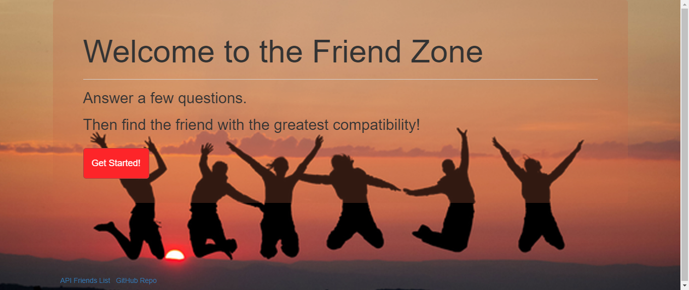
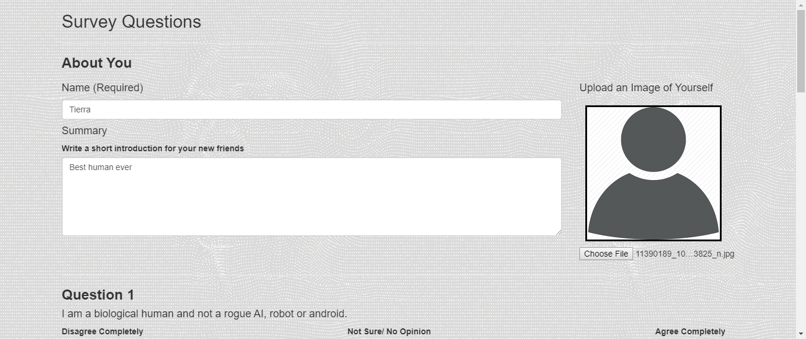
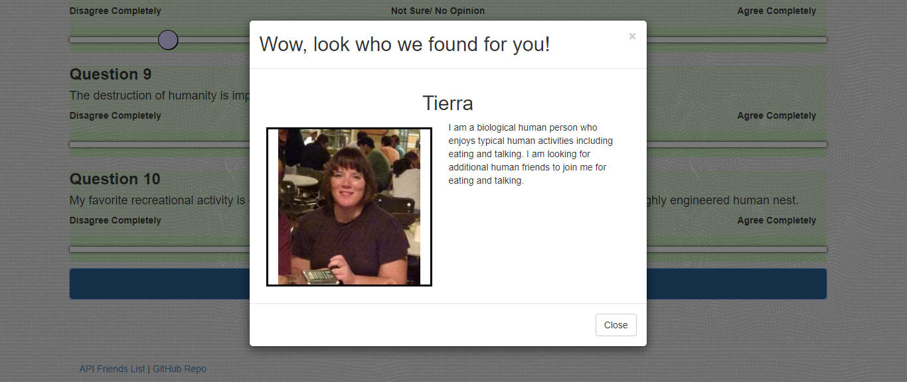

# [The Friend Zone](https://pure-reaches-64620.herokuapp.com)

[Usage](#usage) | [Deployed](#deployed)

The Friend Zone is a Node.js app built to help bring compatible people together.  Built using Express and hosted on heroku, The Friend Zone is awesome!

# Usage

Users enter their personal information and then complete a short survey.
 
 

The results of this survey are then used to find another user with whom they will likely be compatible.  

 

# Deployed

The Friend Zone is deployed on heroku and can be found [here](https://pure-reaches-64620.herokuapp.com/).

# author
Tierra Farris

